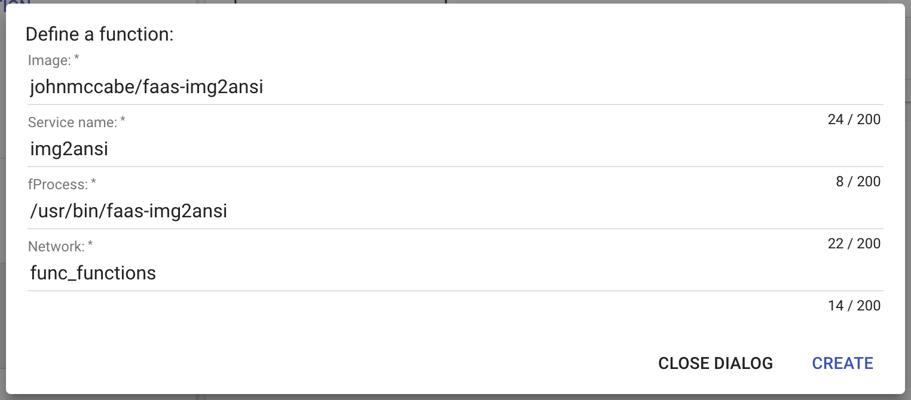

# faas-img2ansi

This repo contains an example [FaaS]() function which uses the [johnmccabe/img2ansi](github.com/johnmccabe/img2ansi) Go library to convert an image to an ANSI string.

It demonstrates the use of a multi-stage build (available in Docker CE 17.06+) to build the Go binary seperately to the FaaS function image so as to keep the size as small as possible.

**NOTE**: Its recommended at this point to stick to small images (`png`, `gif` or `jpeg`) as the resize capability hasn't been added yet.


## Deploying the Function

### Using the CLI (`faas-cli`)
Install the client as described at the [faas-cli repo](https://github.com/alexellis/faas-cli/), then deploy the function as follows:

```
# faas-cli -action deploy -image=johnmccabe/faas-img2ansi -name=img2ansi -fprocess="/usr/bin/faas-img2ansi"
200 OK
URL: http://localhost:8080/function/img2ansi
```

### Using Curl
The function can be deployed using curl to hit the API endpoint directly:
```
# curl -s --fail localhost:8080/system/functions -d \
'{ 
   "service": "img2ansi",
   "image": "johnmccabe/faas-img2ansi",
   "envProcess": "/usr/bin/faas-img2ansi",
   "network": "func_functions"
}'
```

### Using the UI
You can also create the function via the UI at http://localhost:8080/ui, clicking the `Create New Function` link and entering the following data:



## Testing the Function
Now that the function is running in your FaaS environment you can test it from the command line by running:
```
curl localhost:8080/function/kevin2 --data-binary @images/gopher.png
```

**NOTE**: as mentioned earlier, you should stick to small images for the moment (32x32 or so) as the function does not currently scale down large images.